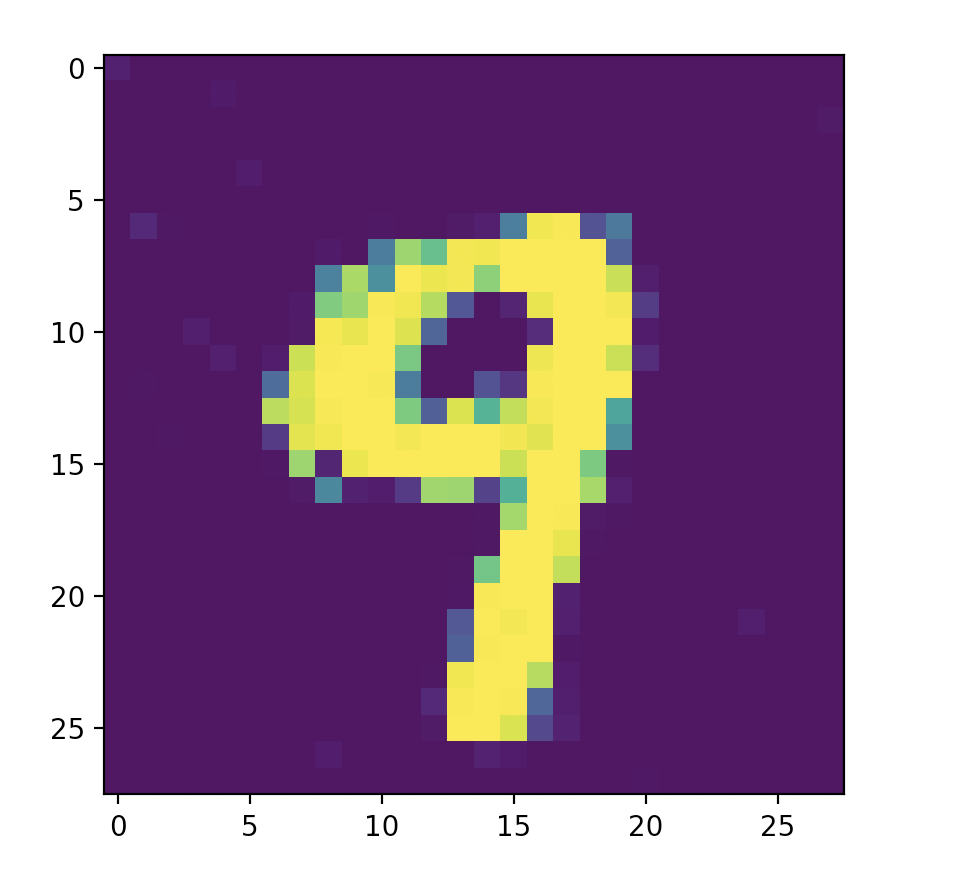

# simple-conditional-GAN

`GAN for generating MNIST handwritten digits`

`Usage:`

```py
G = Generator()
G.load_state_dict(torch.load("PATH"))
noise = torch.randn(1, 100)
image = G(noise, torch.LongTensor([9])).reshape(28, 28).detach().cpu().numpy()
plt.imshow(image)
plt.show()
```


